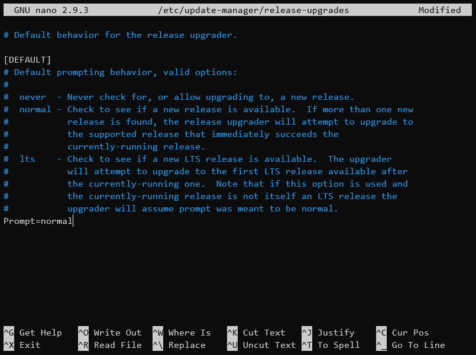
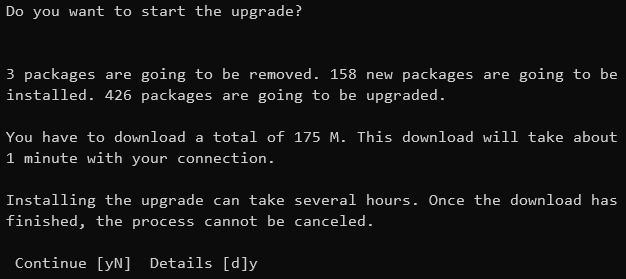
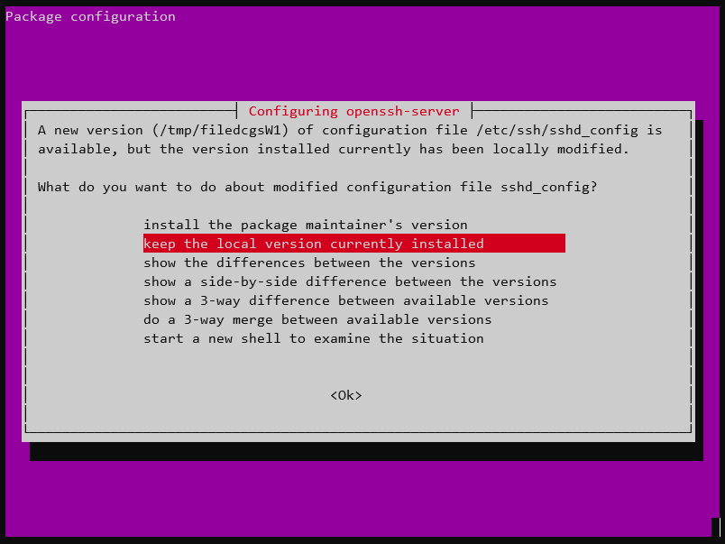
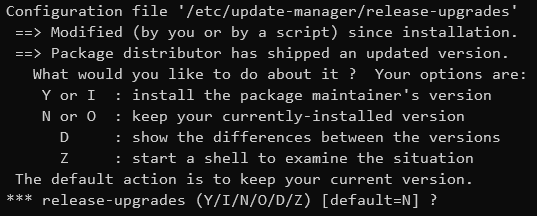
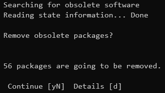
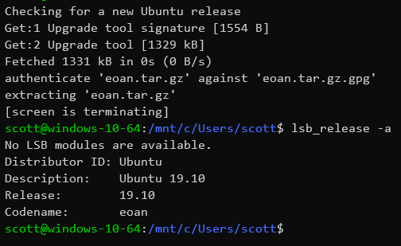

<script>
  import YouTube from '$lib/components/youtube.svelte'
</script>

In this guide I'm going to detail upgrading a Windows Subsystem Linux
(WSL) Ubuntu install from the current version 18.04 to 19.10 this is
an intermediary release before Ubuntu 20.04 is released on 2020
April 23.

I have documented [this process in the past] for moving from Ubuntu
version 18.04 to 18.10. You can see [my comments] as I went through
the process back then.

## 📺 Here's a video detailing the process.

<YouTube youTubeId="IErQ4RnzPOg" />

## Check the current Ubuntu version

Ok, to check the current installed version of Ubuntu from the terminal
I enter `lsb_release -a` to get the currently installed Ubuntu version
displayed.

> LSB stands for Linux Standard Base and the '-a' is for 'all
> information'

```bash
lsb_release -a
```

The output looks like this:


## Do the release upgrade!

To start the upgrade I enter the terminal command
`do-release-upgrade`.

```bash
sudo do-release-upgrade
```


This will prompt me if my `release-upgrades` file isn't set to
`normal`.

## Set release upgrades to normal

Open the `release-upgrades` file path to edit, in this example I'm
using [Nano] to edit the file.

```bash
sudo nano /etc/update-manager/release-upgrades
```

In the file I change the `Prompt` from `Prompt=lts` to
`Prompt=normal`.



To save the file in Nano I use Ctrl+o to write out the file, confirm
(Enter/Return) then to close use I Ctrl+x.

## Do the release upgrade, for realsies

Now the `release-upgrades` file is set to `normal` I can do the
[do-release-upgrade].


You may be aware of an [lxd error] that occurs on the Ubuntu 18.04 to
Ubuntu 18.10 upgrade. This is where there is a prompt saying ["Your
system is unable to reach the snap store"].

I'm going to skip this during the upgrade but you can _**optionally**_
run this when doing this for yourself, here's the command:

```bash
sudo dpkg --force depends -P lxd; sudo dpkg --force depends -P lxd-client
```

Pick the same command again in the terminal, if I arrow up a a couple
of commands I can use it again.

```bash
sudo do-release-upgrade
```

I'm now prompted with the details of what is going to happen in the
upgrade:



I respond with `y` to continue and start the upgrade.

## Warnings and configs

When I'm prompted about `libc6` for restarting services during package
upgrades I use the tab key to select `<Yes>` then return to continue.


Next I have the `Lxd` warning I mentioned earlier, in this case I'm
going to arrow down and select the option to `<Skip>` then hit return
to continue.


In the following screens I'm being asked about package configuration,
I'm going to be picking the option to
`install the package maintainer's version` for all of them.

Same with `openssh-server` arrow up key to to
`install the package maintainer's version` and hit return to continue.



Then there's the `release-upgrades` configuration and yeah I'm going
to select to `install the package maintainer's version` and confirm to
continue.



## Finish up install

One of the last few prompts is to confirm the removal of the obsolete
packages, confirm `y` to continue.



Restart is required now, so I confirm with `y`.


Now I have the confirmation that the do release upgrade completed
successfully. I press Ctrl+c


Then have to press `x` to destroy!


That takes me back to the regular prompt where I can check with
`lsb_release -a` what version I'm now on.



Confirmation the Windows Subsystem Linux version of Ubuntu I'm using
is now on 19.10.

## Wrap up!

That's it! I upgraded a WSL Ubuntu version from 18.04 to 19.10.

First, I changed the default behaviour of the release upgrader from
`lts` to `normal`.

Then `do-release-upgrade`, and I skipped the `Lxd` configuration. It
isn't needed on WSL but is part of the Ubuntu image on the Microsoft
Store 🤔

I accept `install the package maintainer's version` on any
configuration prompts.

Done.

## Thanks for reading 🙏

Please take a look at my other content if you enjoyed this.

Follow me on [Twitter] or [Ask Me Anything] on GitHub.

<!-- Links -->

[twitter]: https://twitter.com/spences10
[ask me anything]: https://github.com/spences10/ama
[this process in the past]:
  https://scottspence.com/2019/04/01/update-wsl-from-18.04-18.10/
[my comments]: https://dev.to/spences10/comment/9n19
[do-release-upgrade]:
  https://help.ubuntu.com/lts/serverguide/installing-upgrading.html
[nano]: https://help.ubuntu.com/community/Nano
[lxd error]: https://dev.to/spences10/comment/9n3j
["your system is unable to reach the snap store"]:
  https://askubuntu.com/questions/1119301/your-system-is-unable-to-reach-the-snap-store
